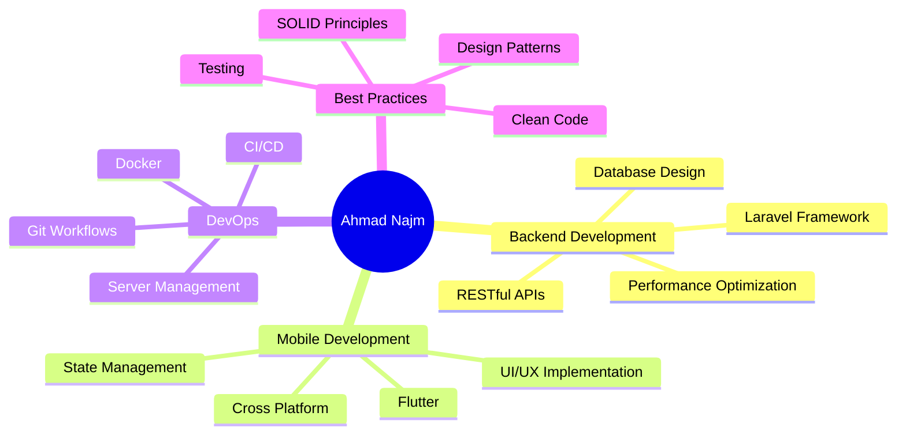

<div align="center">

<!-- Animated Header -->


<!-- Typing Animation -->
<a href="https://git.io/typing-svg"></a>

<p align="center">
  <a href="https://www.linkedin.com/in/ahmad-najm-92200325a/"></a>
  <a href="mailto:ahmadnajim66@gmail.com"></a>
  <a href="https://github.com/ahmadnajmdev"></a>
  
</p>


</div>

<br/>

<!-- About Section with Animation -->


##  About Me

```typescript
const ahmad = {
    pronouns: "He" | "Him",
    code: ["PHP", "Dart", "JavaScript", "TypeScript", "SQL"],
    askMeAbout: ["web dev", "mobile dev", "backend", "API design", "database optimization"],
    technologies: {
        backEnd: {
            framework: ["Laravel", "Livewire"],
            database: ["MySQL", "PostgreSQL", "Redis", "MongoDB"],
            caching: ["Redis", "Memcached"]
        },
        mobile: {
            framework: ["Flutter"],
            platforms: ["Android", "iOS"]
        },
        devOps: ["Docker", "CI/CD", "Git", "Linux"],
        tools: ["VS Code", "Postman", "PHPStorm", "Android Studio"]
    },
    currentFocus: "Building scalable applications with clean architecture",
    funFact: "I debug in my dreams and wake up with solutions"
};
```

<br clear="right"/>

## 🎯 What I Do

<table align="center">
<tr>
<td width="50%" valign="top">

### 🌐 Backend Development
- 🏗️ RESTful API Architecture
- 🔐 Authentication & Authorization
- 📊 Database Design & Optimization
- ⚡ Performance Tuning
- 🧪 Unit & Integration Testing

</td>
<td width="50%" valign="top">

### 📱 Mobile Development
- 📲 Cross-Platform Apps
- 🎨 Pixel-Perfect UI/UX
- 🔄 State Management
- 🌍 API Integration
- 📦 App Store Deployment

</td>
</tr>
</table>

<br/>

## 🛠️ Tech Stack & Tools

<div align="center">

### 💻 Languages


### 🚀 Frameworks & Libraries


### 🗄️ Databases & Caching


### ☁️ Cloud & DevOps


### 🛠️ Development Tools


</div>

<br/>

## 📊 GitHub Statistics

<div align="center">


</div>

<br/>

## 🏆 GitHub Trophies

<div align="center">

[](https://github.com/ryo-ma/github-profile-trophy)

</div>

<br/>

## 🐍 Contribution Snake

<div align="center">


</div>

<br/>

## 💼 Professional Highlights

<div align="center">

| 🎯 Metric | 📊 Achievement |
|-----------|----------------|
| 📱 **Projects Delivered** | 15+ Production Apps |
| 😊 **Happy Clients** | 20+ |
| ⭐ **Code Quality** | 95%+ |
| 🐛 **Avg Bug Resolution** | < 24 Hours |
| 📚 **Lines of Code** | 100,000+ |
| ☕ **Coffee Consumed** | ∞ |

</div>

<br/>

## 🎓 Core Competencies

<div align="center">



</div>

<br/>

## 🌟 Featured Skills

<div align="center">

| Skill Category | Technologies | Proficiency |
|:---------------|:-------------|:------------|
| **Backend** | Laravel, PHP, RESTful APIs | ████████████ 95% |
| **Mobile** | Flutter, Dart | ████████████ 90% |
| **Database** | MySQL, PostgreSQL, Redis | ███████████░ 85% |
| **DevOps** | Docker, Git, Linux | ██████████░░ 80% |
| **Frontend** | Livewire, Alpine.js, Tailwind | ███████████░ 85% |

</div>

<br/>

## 💭 Random Dev Quote

<div align="center">


</div>

<br/>

## 📈 Coding Activity

<div align="center">

<!--START_SECTION:waka-->
<!--END_SECTION:waka-->

</div>

<br/>

## 🤝 Let's Connect & Collaborate

<div align="center">

I'm always excited to collaborate on innovative projects, discuss new technologies, or just have a chat about development! Feel free to reach out.

### 📫 How to reach me:

[](https://www.linkedin.com/in/ahmad-najm-92200325a/)
[](mailto:ahmadnajim66@gmail.com)
[](https://github.com/ahmadnajmdev)

### 💡 Open for:
- 🚀 Exciting Project Collaborations
- 💼 Freelance Opportunities
- 🎯 Technical Consulting
- 📚 Knowledge Sharing
- 🤝 Open Source Contributions

</div>

<br/>

## ⚡ Recent Activity

<!--START_SECTION:activity-->
<!--END_SECTION:activity-->

<br/>

<div align="center">

### 🎯 2024 Goals
- 🚀 Contribute to more Open Source projects
- 📱 Launch 5+ production-ready mobile apps
- 🎓 Master advanced architectural patterns
- 🌍 Build a product that impacts millions
- 📝 Share knowledge through technical writing

<br/>

### 🌈 Fun Facts
- 🎮 When I'm not coding, I'm probably gaming or exploring new tech
- 🎵 I code better with music (Lo-fi beats are my favorite)
- 🌍 I believe technology should make the world a better place
- 📚 Always learning, always growing, always coding
- 💡 "First, solve the problem. Then, write the code."

<br/>

---


### 💖 Thanks for visiting!


### Show some ❤️ by starring some of the repositories!


</div>

<!-- Footer Wave -->

